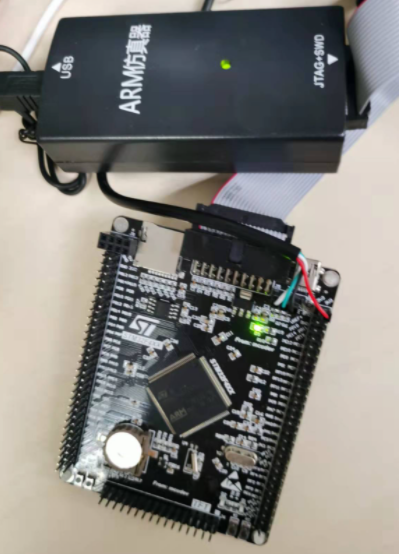

You can follow the steps to run RapidPatch on real device.

# 1. Choose your devices and port the Runtime

Here we use the STM32F407 devices as an example to show how to run RapidPatch in real devices. 



Here we use the Keil Project in VulDevices/Keil-Baremetal-Projs/STM32L475 as an example.  

You can use the prebuild firmware IoTPatch.afx in direction VulDevices/Keil-Baremetal-Projs/prebuild/.  

# 2. RapidPatch Workflow

## 2.1 Find a bug and write eBPF patch 

Example 1:

We have ported two real cve ([cve_2020_10062](https://github.com/zephyrproject-rtos/zephyr/pull/23821/commits/11b7a37d9a0b438270421b224221d91929843de4)) from the RTOS and libraries to the bare-metal firmware.

```
// app\dummy_cve.c
// cve_2020_10062 (packet_length_decode) in ZephyrOS

static struct dummy_MQTT_buf_ctx {
	unsigned char *cur;
    unsigned char *end;
};

// packet_length_decode
int dynamic_patch_dummy_cve2(struct dummy_MQTT_buf_ctx *buf, uint32_t *length)
{
	uint8_t shift = 0U;
	uint8_t bytes = 0U;

	int ERR = -1;

	*length = 0U;
	do {
		if (bytes > 4) {
			return ERR;
		}

		if (buf->cur >= buf->end) {
			return ERR;
		}
		// 
		*length += ((uint32_t)*(buf->cur) & 0x7f) << shift;
		shift += 7;
		bytes++;
	} while ((*(buf->cur++) & 0x80) != 0U);

	return 0;
}

```

To trigger the vulnerable function, we construct illegal input as follows. The correct buffer length should be 0. However, without installing the patch, we will get a overflow length value -1. The correct  length for this illegal packet should be 0.

```
static void call_dummy_buggy_MQTT_function() {
	uint8_t packet_buf[10];
	for (int i=0; i<4; ++i) packet_buf[i] = 0xff;
	packet_buf[4] = 0x7f;
	for (int i=5; i<10; ++i) packet_buf[i] = 0;
	struct dummy_MQTT_buf_ctx dbc;
	dbc.cur = &packet_buf[0];
	dbc.end = &packet_buf[9];	
	uint32_t pkt_length = 0;
	int ret = dummy_buggy_MQTT_packet_length_decode(&dbc, &pkt_length);
	DEBUG_LOG("Decoded MQTT packet length is %d\n", pkt_length);
	if (pkt_length != 0) {
		DEBUG_LOG("The buggy function is still vulnerable!\n");
	} else {
		DEBUG_LOG("The buggy function is fixed!\n");
	}
}
```


We write an ebpf filter patch to fix this bug:

```
#include "ebpf_helper.h"

#define EINVAL 22
#define MQTT_LENGTH_CONTINUATION_BIT 0x80
#define MQTT_LENGTH_SHIFT 7
#define MQTT_LENGTH_VALUE_MASK 0x7F
#define MQTT_MAX_PAYLOAD_SIZE 0x0FFFFFFF

struct buf_ctx {
	unsigned char *cur;
    unsigned char *end;
};

uint64_t filter(stack_frame *frame) {
    struct buf_ctx *buf = (struct buf_ctx *)(frame->r0);
    uint32_t op = 0;
    uint32_t ret_code = 0;
    unsigned char end_index = 0;
    
    for (int i = 0; i < 5; i++) {
        if (((*(buf->cur + i)) & MQTT_LENGTH_CONTINUATION_BIT) == 0) {
            end_index = i;
            break;
        }
    }
    if (end_index >= 4) {
        op = 1;
        ret_code = -EINVAL;
        return set_return(op, ret_code);
    }
    
    // length limit validation
    uint32_t length = 0U;
    uint32_t shift = 0U;
    for (int i = 0; i <= end_index; ++i) {
		length += ((uint32_t)*(buf->cur + i) & MQTT_LENGTH_VALUE_MASK)
								<< shift;
		shift += MQTT_LENGTH_SHIFT;
    }

    if (length > MQTT_MAX_PAYLOAD_SIZE) {
        op = 1;
        ret_code = -EINVAL;
    }

    return set_return(op, ret_code);
}
```

Then we verify and generate the eBPF bytecode patch.

```
# generate
 python3 main.py gen test-files/patches/test_cve1.c test-files/bin/test_cve1.bin
# write binary to: test-files/bin/dummy_cve1.bin
# save byte code to ToolChain/PatchGenerator/tools/ebpf_code.h

# verify
 python3 main.py verify test-files/bin/test_cve1.bin
```


Example 2 (unbounded loop with SFI):

We use the CVE_2020_17445 as an example to demonstrate the vulnerability and the patch are with unbound loop (infinite loop).

```
// CVE_2020_17445_pico_ipv6_process_destopt
int dynamic_patch_dummy_cve2(uint8_t *destopt, uint8_t *f, uint32_t opt_ptr)
{
    uint8_t *option = NULL;
    uint8_t len = 0, optlen = 0;
    option = (destopt + 2); /* Skip Dest_opts header */
    len = (uint8_t)(((*(destopt + 1) + 1) << 3) - 2); /* len in bytes, minus nxthdr and len byte */
    while (len) {
        optlen = (uint8_t)(*(option + 1) + 2);
        switch (*option)
        {
        case PICO_IPV6_EXTHDR_OPT_PAD1:
            break;

        case PICO_IPV6_EXTHDR_OPT_PADN:
            break;

        case PICO_IPV6_EXTHDR_OPT_SRCADDR:
            // ipv6_dbg("IPv6: home address option with length %u\n", optlen);
            break;

        default:
            // THE CODE HERE IS OMITTED FOR BREVITY
            break;
        }
        opt_ptr += optlen;
        option += optlen;
        len = (uint8_t)(len - optlen);
    }
    return 0;
}
```

The patch code is as follows,

```
uint64_t filter(stack_frame *frame) {
    uint32_t opt_ptr = (uint32_t)(frame->r2);
    opt_ptr += (uint32_t)(2u);
    uint8_t *destopt = (uint8_t *)(frame->r0);
    uint8_t *option = (destopt + 2);
    uint8_t len = (uint8_t)(((*(destopt + 1) + 1) << 3) - 2);
    uint8_t optlen = 0;
    uint32_t op = 0;
    uint32_t ret_code = 0;

    while (len) {
        optlen = (uint8_t)(*(option + 1) + 2);
        if (opt_ptr + optlen <= opt_ptr || option + optlen <= option || len - optlen >= len) {
            ret_code = -1;
            break;
        }
        opt_ptr += optlen;
        option += optlen;
        len = (uint8_t)(len - optlen);
    }

    if (ret_code != 0) {
        // intercept
        op = 1;
    }
    return set_return(op, ret_code);
}
```

When SFI is enable, the loop will end in x800 iterations and it will return FILTER_DROP.

```

# compile and verify the patch
$  python3 main.py gen test-files/patches/test_cve2.c test-files/bin/test_cve2.bin
$  python3 main.py verify test-files/bin/test_cve2.bin

# 
Add SFI Post process to the eBPF bytecode: test-files/bin/test_cve2_sfi.bin
mov r8, 0x0
ldxw r2, [r1]
ldxw r3, [r1+8]
add r3, 0x2
ldxb r1, [r2+1]
add r2, 0x2
lsh r1, 0x3
or r1, 0x6
lddw r0, 0x100000000
# lddw[2] r0, 0x1
lddw r4, 0xffffffff
# lddw[2] r4, 0x0
ldxb r5, [r2+1]
add r5, 0x2
mov r7, r5
and r7, 0xff
jeq r7, 0x0, +19
mov r6, r3
add r6, r7
mov r7, r6
lsh r7, 0x20
rsh r7, 0x20
lsh r3, 0x20
rsh r3, 0x20
jge r3, r7, +11
sub r1, r5
and r5, 0xff
add r2, r5
mov r4, 0x0
mov r5, r1
and r5, 0xff
mov r3, r6
mov r0, 0x0
add r8, 0x1
jsgt r8, 0x800, +3
jne r5, 0x0, -28
or r0, r4
exit
mov r0, 0x1
lsh r0, 0x20
exit
```


## 2.2 Install and run the patch

### Quickly run patch from local code

Since some boards do not support ethernet network, we manually copy the patch bytecode to the firmware. Currently, we have put three testing patch in the firmware.

```
// hotpatch\src\dynamic_patch_load.c:123
static struct local_patch patch_list[] = {
	// {"my test cve", 0x08002820, test_cve, sizeof(test_cve)},
	// {"my test cve", 0x00009c98, test_cve, sizeof(test_cve)},
	// 080072e0 the address is set in directly to the address of the vulnerable function
	{"my test cve", 0x080072e0, test_cve, sizeof(test_cve)},
	{"dynamic patch dummy cve_2020_10062", 0x00009740, zephyr_cve_10062, sizeof(zephyr_cve_10062)},
	{"dynamic patch dummy CVE_2020_17445", 0x00009740, AMNESIA33_cve_2020_17445_SFI, sizeof(AMNESIA33_cve_2020_17445_SFI)},
	}
	
// avoid to fill in the patch installing address every time, we just reset it the function address
patch_list[0].loc = (uint32_t) test_dynamic_bug;
patch_list[1].loc = (uint32_t) dynamic_patch_dummy_cve1;
patch_list[2].loc = (uint32_t) dynamic_patch_dummy_cve2;
```

   Note that the second parameter of patch_list is the patching address. In this example, it should be the address of the vulnerable function. We can get the address from the prebuild/IoTPatch.map file.  Rather than obtain it every time from the symbol file, we just set it to the function address in the code.

```
# IoTPatch.map
dynamic_patch_dummy_cve1                 0x080079c3   Thumb Code    80  dummy_cve.o(.text)
```


#### Use KProbe (Debug Monitor) to run the Patch.

You can use `trigger + idx` to call a vulnerable function and use `patch idx` to install patch for this function and then, trigger the vulnerable function again.  

Example 1.

```
// before installing the patch
$ trigger 1
run dynamic_patch_dummy_cve1 func at addr:0x08007011
Decoded MQTT packet length is -1
The buggy function is still vulnerable!

// after installing the patch
$ patch 1
 ... // logs for installing the patch
$ trigger 1
run dynamic_patch_dummy_cve1 func at addr:0x08007011
enter leave_fpb_bpkt bpkt_idx: 0
run_ebpf_filtern res: 1 4294967274
filter and return: 4294967274 0x0800b5cf 0x00000000
set_return: 0x0800b5cf
leave_fpb_bpkt: 0x08007010
Decoded MQTT packet length is 0
The buggy function is fixed!
```

Example 2.

If you calling the vulnerable function without installing the patch, it will lead to a deadloop. 

```
$ trigger 2
run dynamic_patch_dummy_cve2 func at addr: 0x08007061
```

We need to install the patch first. The patch code have an unbound loop and will lead to dead loop with current input.  

Since the patch is generated with SFI enforcement, it will ends after x0800 (2048) iterations. (See Chapter 3)

```
$patch 2
// .... 
$ trigger 2
run dynamic_patch_dummy_cve2 func at addr: 0x08007061
debug_monitor_handler_c lr:0x0800b707 pc:0x08007060
run_ebpf_filter res: 1 4294967295
filter and return: 4294967295 0x0800b707 0x08007060
set_return: 0x0800b707
Exit loop. The return code of the buggy function is -1
```


#### Use FPB Flash Patch Mode to run Patch.

1. Test if the FPB flash patch works properly on this device

   We have provide a sample test to check if the FPB flash patch can work properly on each board. You can trigger in by `run 2`.

   Unfortunately, the FPB flash patch works incorrectly on my STM32F407 board and lead to hardware fault exception.

   Here is the correct results on STM32F429 and STM32L475,

```
// hotpatch\src\cortex-m4_fbp.c:1081 test_fpb_flash_patch
$ run 2
run cmd: 2 {Test FPB Flash Patch.}
test_debug_fpb_patch
Before add FPB Flash Patch.
enter RawBuggyFunc
exit RawBuggyFunc
Setup FPB Flash Patch.
buggy_addr: 0x08003f54 fixed_addr: 0x08002094
ADDR: 0x20012d48 excepted value: 0xb89ef7fe
remap: 0x20012d40 inst addr: 0xb89ef7fe
After FPB Flash Patch.
run FixedBuggyFunc
```

2. Use FPB flash patch as dynamic patch trigger

   At first, we should change the patch installing mode in patch installing function (handle_patch_func).

   ```
   	// static void handle_patch_func(int pid)
   	// app\ihp_cli.c:300 
   	
   	// Modify the patch mode to CORTEX_FPB_PATCH
   	// set_patch_mode(CORTEX_DEB_MON_PATCH);
   	set_patch_mode(CORTEX_FPB_PATCH);
   ```

   

   We use the dummy_cve1 (unbounded loop) as an example.

   The patch is dispatched by the leave_fpb_bpkt (hotpatch\src\cortex-m4_fbp.c:720).

```
$ patch 2
$ trigger 2
run test func at addr: 0x08007011
enter leave_fpb_bpkt bpkt_idx: 0
run_ebpf_filtern res: 1 4294967295
filter and return: 4294967295 0x0800b5b3 0xfefe0101
set_return: 0x0800b5b3
leave_fpb_bpkt: 0x08007010
Exit loop. The return code of the buggy function is -1
```


### Deploy patch remotely via Usart

TODO.

# 3. SFI implementation

In interpreter mode, we restrict the total iterations directly in the vm main loop,

```
  int tick = 0;
  
  // ...
  if (!iters_check(tick++)) {
        // FILTER_DROP
        return 1 << 32;
    }
}

bool iters_check(int tick) {
	if (tick > MAX_ITERS) {
		return false;
	}
}
```

For jit mode, currently, we can use the python verifier (in Toolchain\PatchVerify\sfi_post_process.py) to generate a new bytecode with SFI enforcement which have inserted the SFI instructions for each backward loop.

```
# the origin the backward jump
jne r5, 0x0, -28

# backward jump with SFI
# we save the total iterations in r8
add r8, 0x1
jsgt r8, 0x800, +3
jne r5, 0x0, -28
or r0, r4
exit
mov r0, 0x1
lsh r0, 0x20
exit
```

